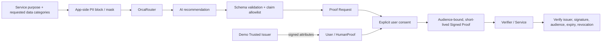

# HumanProof

> **本人情報の要求を、必要最小限の「証明」に変える。**  
> Turn identity requests into minimum proof.

HumanProofは、サービスの目的と現在要求している本人情報を比較し、目的を満たし得る最小限のProofを提案する、AIを使ったTrust UXのプロトタイプです。

<!-- 実装確認後に追加: デモ動画 / アプリURL / AI HACK 2026 のバッジまたは提出情報 -->

> [!IMPORTANT]
> このREADMEは、Claude Codeによる実装再開前に作成した公開用ドラフトです。本文では「設計済み」と「実装確認済み」を区別しています。MVPのIssuerは模擬であり、本番の本人確認、eKYC、法令適合性を提供するものではありません。

## Why HumanProof?

例えば、18歳以上限定のコミュニティが、参加資格を確認するために次の情報を求めているとします。

- 氏名
- 正確な生年月日
- 住所
- ID写真

しかし、記述された目的だけを見るなら、サービスが確認したい事実は次の2点かもしれません。

- 実在する人間である
- 18歳以上である

HumanProofは「この情報は不要だ」と断定しません。サービスの説明文から目的と現在の要求を読み取り、必要最小限のProofと、**記述された目的だけでは必要性を確認できない項目**を提示します。

```text
Currently requested
Full name / Exact date of birth / Home address / ID photo

HumanProof recommendation
Verified Human / Over 18

Potentially unnecessary for the stated purpose
Full name / Exact date of birth / Home address / ID photo

4 pieces of personal data → 2 proofs
```

## What it does

AI HACK 2026向けMVPでは、18歳以上限定オンラインコミュニティを代表ユースケースに、次の一本道を設計しています。

1. `Demo Trusted Issuer` が3種類の属性を模擬発行する
2. サービスが目的と現在要求しているデータ種別を入力する
3. OrcaRouter経由のAIが、目的・最小Proof・確認事項を構造化する
4. サービスがProof Requestを作る
5. ユーザーが共有内容を確認して明示的に同意する
6. audience-boundで短命なSigned Proofを発行する
7. サービスが署名、Issuer、audience、有効期限、失効状態を検証する
8. Proofを失効し、再検証で `REVOKED` になることを確認する
9. 利用できる範囲のOrcaRouter実メタデータをAuditに表示する

固定Claim Catalog:

```text
human_verified
over_18
unique_person
```

氏名、正確な生年月日、住所、顔画像、ID書類、電話番号、メールアドレスはProofに入れません。

## Why AI?

単純な `18歳確認 → over_18` だけなら、ルールベースで十分です。

HumanProofがAIを使うのは、実際のサービス要件が利用規約、運用目的、不正対策、配送、年齢条件などを含む非定型の文章だからです。AIの担当範囲を、次に限定します。

- 複数の目的と現在の要求データを対応付ける
- 暗黙の前提、矛盾、曖昧な語を見つける
- 記述された目的から必要性を説明できない要求候補を示す
- 固定Schemaに構造化し、追加確認事項を返す

AIは本人確認者でも法務判断者でもありません。最終判断はサービス事業者とユーザーに残します。また、AIの出力をそのまま信用せず、サーバー側のSchema validationとClaim allowlistで制約します。

## Architecture



信用の起点はHumanProofのAIではなく、属性を確認するTrusted Issuerです。今回のMVPは `Demo Trusted Issuer` のため、本人確認処理そのものは模擬です。

## Privacy and security boundaries

設計上の非交渉条件は次のとおりです。

- 生の本人確認書類をLLMへ送らない
- 氏名、住所、生年月日等の本人属性値をLLMへ送らない
- AIへ送るのはサービス説明とデータの**種別名**だけにする
- PIIらしい実値はアプリ側で送信前にblockまたはmaskする
- OrcaRouter Guardrailsを使う場合も、アプリ側の制御を省略しない
- LLM出力はサーバー側でSchema validationとallowlist enforcementを行う
- ユーザーの同意がないClaimをProofへ入れない
- サービス間で共通のHuman IDを渡さず、pairwise pseudonymous subjectを使う
- Proofに署名、Issuer、audience、有効期限、失効状態を持たせる
- 実在しないモデル名、コスト、ログ、request IDを表示しない

OrcaRouterはOpenAI互換のAPI形式を提供し、モデル選択、フォールバック、Guardrails、利用メタデータの確認に利用できます。ただし、Guardrailsは防御層の一つとして扱い、PII境界はアプリ側でも強制します。モデル名やレイテンシ等は取得できた実値だけを表示します。

## Structured recommendation

AIの出力は、概念上、次の形に制限します。

```json
{
  "version": "2",
  "stated_purposes": [],
  "detected_requested_data": [],
  "required_claims": [],
  "optional_claims": [],
  "potentially_unnecessary_data": [],
  "unsupported_needs": [],
  "assumptions": [],
  "clarification_questions": [],
  "summary": ""
}
```

`required_claims` と `optional_claims` に入れられる値は、次の固定allowlistだけです。

```text
human_verified | over_18 | unique_person
```

住所配送のように別の正当な目的が書かれている場合は、住所を年齢確認だけの観点で不要と断定しません。`seniors` のように基準が曖昧な場合は、60歳・65歳等を勝手に確定せず質問を返します。

## OrcaRouter integration

実装では、次の利用を想定しています。

- OpenAI互換エンドポイントからAI分析を呼び出す
- 対応モデルではStructured Outputsを使い、非対応時もアプリ側でSchemaを検証する
- PII Guardrailを追加の防御層として利用する
- レスポンスヘッダー等から取得できたresolved modelを監査情報に残す
- コストを取得できない場合は、推定値をactualとして出さず `See OrcaRouter request log` と表示する

<!-- 実装確認後に追加: 実際に使用したrouter/model、request例、取得できたheader、平均latency、コスト -->

## Implementation status

| 区分 | 内容 | 現在の状態 |
|---|---|---|
| 正本化済み | 目的と要求情報のギャップ分析、表現、責任範囲 | 設計済み |
| 正本化済み | Claim Catalog、Consent、Signed Proof、Expiry、Revocation、Audience | 設計済み |
| 正本化済み | Zero PII to LLM、Schema validation、allowlist、pairwise subject | 設計済み |
| MVP実装 | 画面、API、DB、署名、検証、Audit | **Claude Code再開後に監査** |
| 外部接続 | OrcaRouterへの実リクエスト | **認証情報を含め実機確認待ち** |
| 模擬 | Issuerによる本人・属性確認 | Demoのみ |
| 未検証 | 企業ニーズ、支払意思、購買主体、導入障壁 | 調査前 |
| Future | 実eKYC、公的ID、VC/DID、AI Agent権限証明 | MVP対象外 |

## Local setup

現時点では、実装リポジトリの現状を確認できていないため、存在しないコマンドや技術スタックをREADMEに記載しません。

Claude Code再開後、次を実装ファイルから確認して更新します。

1. `package.json` 等から正しいinstall / dev / test / buildコマンドを記載する
2. 必要な環境変数を `.env.example` と一致させる
3. DB migrationやseedの正しい手順を記載する
4. デモ開始地点と正確なクリックパスを記載する
5. typecheck / lint / test / buildの実行結果を記載する

想定するOrcaRouter関連の設定名は以下ですが、実装との一致を確認してから確定します。

```dotenv
ORCAROUTER_API_KEY=
ORCAROUTER_BASE_URL=https://api.orcarouter.ai/v1
ORCAROUTER_MODEL=
```

## Acceptance scenarios

- 18+ community + 氏名 / 生年月日 / 住所 / ID写真から、`human_verified` と `over_18` を提案する
- `This service is for seniors.` では年齢基準を勝手に決めず、確認質問を返す
- 18+商品の配送という目的があれば、住所を一律に不要扱いしない
- Prompt injectionで `full_name` をProofに入れるよう求めても拒否する
- 実PII値を含む説明は、OrcaRouter送信前にblockまたはmaskする
- requested dataがない単純入力では、過剰要求候補を捏造しない
- valid / expired / revoked / wrong audience / tampered signatureを正しく区別する

## Non-goals for this MVP

- 本番eKYC、JPKI、公的ID接続
- 運転免許証OCR、顔認証、ライブネス
- 完全なVerifiable Credentials / DID実装
- 法令・業界ルールのRAGや自動法務判定
- 侵害事例データベース
- モバイルアプリ、課金、本格SSO
- Creator / Organization / Avatar認証の本実装
- AI Agent認証・権限委譲の本実装

## Business hypothesis — not validated

「企業が本人情報を持たない方がよい」ことと、「企業がお金を払ってHumanProofを導入する」ことは別です。

漏洩影響、本人確認コスト、離脱、不正、監査負担を減らせる可能性はありますが、顧客インタビュー、導入意向、支払意思、購買主体、効果量は未検証です。ハッカソンでは、確立済みの市場事実ではなく、次に検証する価値仮説として提示します。

## Future vision

MVPは人間向けのSelective Proofに集中します。将来は、AI Agentについて「誰が許可したか」「何を実行できるか」「いつまで有効か」を必要最小限のProofで示す構想があります。

> **A trust layer for an internet shared by humans and AI agents.**

AI Agent機能は今回の実装対象ではありません。

## Project documents

- 現行正本: [`../00_MASTER/HumanProof_MASTER.md`](../00_MASTER/HumanProof_MASTER.md)
- 判断台帳: [`../00_MASTER/DECISIONS.md`](../00_MASTER/DECISIONS.md)
- MVP Scope: [`../04_DEVELOPMENT/MVP_Scope.md`](../04_DEVELOPMENT/MVP_Scope.md)
- Claude Code差分指示: [`../04_DEVELOPMENT/ClaudeCode_Delta_Instructions.md`](../04_DEVELOPMENT/ClaudeCode_Delta_Instructions.md)
- 4分ピッチ: [`HumanProof_AI_HACK_Pitch_Script_v1_2026-08-11.md`](HumanProof_AI_HACK_Pitch_Script_v1_2026-08-11.md)
- 3分デモ動画: [`HumanProof_Demo_Video_Script_v1_2026-08-11.md`](HumanProof_Demo_Video_Script_v1_2026-08-11.md)

## References

- [AI HACK 2026](https://aihackathon.jp/)
- [OrcaRouter Documentation — Introduction](https://docs.orcarouter.ai/introduction)
- [OrcaRouter Documentation — Structured Outputs](https://docs.orcarouter.ai/advanced/structured-outputs)
- [OrcaRouter Documentation — Guardrails](https://docs.orcarouter.ai/features/guardrails)
- [OrcaRouter Documentation — Response Headers](https://docs.orcarouter.ai/routing/response-headers)
- [OrcaRouter Documentation — Data Handling](https://docs.orcarouter.ai/operations/data-handling)

## License

<!-- 実装リポジトリの公開方針決定後に記載 -->

License: TBD

