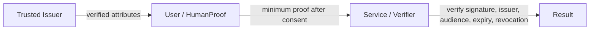

<!--
Qiitaへ掲載する場合は上のZenn front matterを削除し、タグを設定してください。
公開前に本文中の「実装確認後に更新」をすべて解消し、実画面・リポジトリ・動画URLを追加してください。
-->

# 本人確認AIを作らず、「本人情報の要求」を最小Proofへ変えるHumanProofを考えた

私は普段、マーケティングや新規事業企画に関わっていて、エンジニアではありません。今回、[AI HACK 2026](https://aihackathon.jp/)に1人で参加し、Claude Codeに実装を任せながら、複数のAIとプロダクト設計を壁打ちしています。

作っているのは **HumanProof** というWebプロトタイプです。

> **本人情報の要求を、必要最小限の「証明」に変える。**

この記事では、最初の「必要な証明をAIが選ぶ」という案がなぜ弱かったのか、そこから何を変えたのか、そしてまだ何を証明できていないのかを書きます。

> **開発状況について:** 本稿はClaude Codeの利用制限中に仕様を再整理した時点の原稿です。掲載前に実装を再開し、画面、技術スタック、テスト結果、OrcaRouterの実測値を確認して更新します。MVPのIssuerは模擬であり、本番の本人確認は行いません。

## 原点は「18歳以上」のために免許証の全部を渡す違和感

あるサービスが「18歳以上か確認したいので、本人確認書類をアップロードしてください」と求める場面を考えます。

運転免許証には、年齢確認の目的を超えて、次のような情報が含まれています。

- 氏名
- 正確な生年月日
- 住所
- 顔写真
- 書類番号

でも、そのサービスが本当に確認したいことが、

- 実在する人間である
- 18歳以上である

だけなら、本人情報そのものを渡さずに、この2つの事実だけ証明できないだろうか。これがHumanProofの出発点でした。

```text
「あなたが誰か」を渡す
        ↓
必要な事実だけを証明する

Verified Human
Over 18
```

## Selective Disclosureだけでは、新しい提案にならなかった

調べていくと、「必要な属性だけを提示する」という考え方自体は新しくありません。デジタルIDウォレット、Verifiable Credentials、年齢確認、再利用可能なデジタルIDなど、すでに多くの仕組みや取り組みがあります。

そこで問いを変えました。

既存の仕組みが「持っている資格情報から、何を提示するか」を扱うなら、そのさらに前段にある、

> **サービスは、そもそも何を要求すべきなのか**

を見直す余地があるのではないか。

これは競合との差別化が確立した、という意味ではありません。HumanProofが独自の価値を持てるかもしれない、という現時点の仮説です。

## 最初のAI案は、ルールベースで十分だった

当初は、サービスが自然言語で目的を書くと、AIが必要なClaimを選ぶ設計でした。

```text
18歳以上の人だけ参加できる
        ↓ AI
over_18
human_verified
```

しかし、これは弱い設計です。

`18歳確認 → over_18` という対応だけなら、固定ルールやテンプレートで十分です。AIを呼び出すことはできても、AIを使う必然性はありません。

MistralとSakana AIにも厳しめの壁打ちを依頼したところ、指摘はほぼ同じ方向に収束しました。

- Selective Disclosureそのものは新しくない
- 単純なClaim選択はルールベースで実現できる
- 面白さがあるなら、目的と現在の要求情報のズレを見つける部分
- AIが「不要」「違法」と断定するのは危険
- 規制知識や過去事例との照合は魅力的だが、MVPには重すぎる

この指摘を受け、AIの役割を変えました。

## AIの役割を「目的と要求のギャップ分析」に変えた

現在のHumanProofでは、サービス事業者が「目的」と「現在の取得方法」を文章で入力します。

```text
We operate an 18+ community.
We currently ask users for their full name,
exact date of birth, home address and ID photo
to confirm eligibility.
```

AIは次の順で整理します。

```text
Stated purpose
✓ Adult eligibility
✓ Human verification

Currently requested
Full name
Exact date of birth
Home address
ID photo

HumanProof recommendation
✓ Over 18
✓ Verified Human

Potentially unnecessary for the stated purpose
⚠ Full name
⚠ Exact date of birth
⚠ Home address
⚠ ID photo

4 pieces of personal data → 2 proofs
```

ここで重要なのは、`Unnecessary` と断定しないことです。

住所には配送目的があるかもしれません。氏名には規制や契約上の要請があるかもしれません。サービスの説明文に書かれていない不正対策や運用目的もあり得ます。

そのためHumanProofが言うのは、

> この情報は不要です

ではなく、

> **あなたが記述した目的だけを見る限り、この情報が必要な理由を確認できません**

です。AIは結論を決める権限者ではなく、要求設計を見直すためのAssistantです。

## それでもAIを使う理由

単純なケースがルールベースで十分であることは変わりません。

AIを使う対象は、利用規約、運用目的、不正対策、配送、年齢条件などが混ざった非定型の文章です。HumanProofでは、AIの仕事を次に限定します。

1. 複数の目的を抽出する
2. 目的と現在要求しているデータを対応付ける
3. 暗黙の前提や矛盾を見つける
4. `高齢者` のような曖昧な基準に確認質問を返す
5. 固定されたClaim Catalogへ構造化する

例えば、

```text
This service is for seniors.
```

という入力に対して、AIが勝手に「65歳以上」と決めるのは危険です。HumanProofは、60歳なのか65歳なのか、別の定義なのかを質問として返す設計にします。

また、

```text
18歳以上向けの商品を自宅へ配送する
```

という目的なら、住所は年齢確認には不要でも、配送には必要かもしれません。単純に赤い警告を出すのではなく、複数目的との対応を扱う必要があります。

## AIをTrustの根源にしない

ここで別の問題があります。

HumanProofが自分で「この人は18歳以上です」と表示するだけでは、サービス側にとって信用できる証明にはなりません。

信用の起点は、本人や属性を確認する **Trusted Issuer** です。



AIが担当するのは「何を要求すべきか」の推薦です。Issuerが属性を確認し、ユーザーが共有へ同意し、VerifierがProofを検証します。

今回のMVPで使うのは **Demo Trusted Issuer** です。本人確認が完了したように見せかけるのではなく、UIとREADMEで模擬だと明示します。本番化には、公的ID、eKYC事業者、資格発行者等との接続が必要です。

## MVPで見せる一本道

AI HACKのデモでは、機能を広げるより、Trustの流れが切れずに見えることを優先します。

1. Demo Issuerが `human_verified`、`over_18`、`unique_person` を模擬発行
2. サービスが目的と現在要求しているデータ種別を入力
3. OrcaRouter経由でAI分析
4. 目的、最小Proof、要求見直し候補、前提、確認質問を表示
5. サービスがProof Requestを作成
6. ユーザーが共有内容を確認して明示同意
7. audience-boundで短命なSigned Proofを発行
8. 署名、Issuer、audience、期限、失効を検証
9. Proofを失効し、再検証で `REVOKED` を表示
10. OrcaRouterから取得できた実際の監査メタデータを表示

固定するClaimは3つだけです。

```text
human_verified
over_18
unique_person
```

氏名、正確な生年月日、住所、顔画像、ID書類、電話番号、メールアドレスはProofへ入れません。

## OrcaRouterをどこに使うか

HumanProofでは、サービス要件の分析をOrcaRouter経由でLLMへ送ります。

[OrcaRouterの公式ドキュメント](https://docs.orcarouter.ai/introduction)によると、OpenAI互換形式のAPIを提供しており、既存のクライアントから接続先を切り替えられます。ルーティングやフォールバックをまとめて扱えるため、MVPではAI分析の入口として使います。

出力は自由文のまま採用せず、固定Schemaへ構造化します。[Structured Outputs](https://docs.orcarouter.ai/advanced/structured-outputs)は対応する上流モデルで利用できますが、モデルごとに互換性が異なるため、どの経路でも最後はアプリ側でSchema validationとClaim allowlistを強制します。

監査画面には、取得できた実値だけを出します。[Response Headers](https://docs.orcarouter.ai/routing/response-headers)で確認できるresolved model等を利用し、取得できないprovider名やコストを捏造しません。

<!-- 実装確認後に更新: 実際のrouter/model、request ID、latency、token、cost、スクリーンショット -->

## Zero PII to LLMをどう守るか

HumanProofでAIへ渡す必要があるのは、サービスの目的と、`full_name` や `address` といったデータの**種別名**です。Demo Userの氏名や住所、生年月日、ID画像、Proof payloadを送る必要はありません。

安全境界は次のように設計します。

- 自由文に実在人物のPII値がないか、アプリ側で送信前に確認する
- 検出した値はblockまたはmaskする
- 生の本人確認書類と本人属性値をLLMへ送らない
- Prompt injectionがあっても固定Claim以外を採用しない
- LLM出力をHTMLやコードとして実行しない
- 監査ログにも実PII値を残さない

[OrcaRouter Guardrails](https://docs.orcarouter.ai/features/guardrails)にはPII検出と `block`、`mask`、`flag` の動作があります。ただし、これだけを唯一の防御境界にはしません。アプリ側の事前制御を残した上で、追加の防御層として使います。

データ処理についても、OrcaRouter自身が保持するメタデータと、上流モデル事業者への転送を分けて考える必要があります。公開前には、[Data Handlingの説明](https://docs.orcarouter.ai/operations/data-handling)と実際に選んだ上流モデルの条件を確認します。

## LLMの推薦をそのままProofにしない

AIが返したJSONが構文上正しくても、安全とは限りません。

そこでサーバー側に次の制約を置きます。

```text
SUPPORTED_CLAIMS =
  human_verified
  over_18
  unique_person
```

- allowlist外のClaimを拒否する
- required / optionalの重複を拒否する
- PIIをClaimへ変換しない
- 見直し候補は、現在要求している項目だけに限定する
- AI出力が空・不正なら1回だけ再試行し、その後は安全に失敗する
- ユーザーが同意していないClaimをProofへ入れない

AIは提案できますが、権限を持ちません。

## Proofで検証するもの

最小のデモでも、単なるチェックマーク画像にはしません。Proofには次を持たせます。

- 署名
- Issuer
- audience
- 有効期限
- 失効状態
- サービスごとのpairwise pseudonymous subject

同じユーザーでも、サービスAとサービスBへ同じ共通IDを渡さない設計です。Verifier側では、正常系だけでなく次も区別します。

- valid
- expired
- revoked
- wrong audience
- tampered signature

<!-- 実装確認後に更新: 署名方式、保存方式、実テスト結果 -->

## 現在「できた」と言えること、言えないこと

原稿時点では、企画・仕様と実装済み事実を混ぜないよう、状態を分けています。

| 状態 | 内容 |
|---|---|
| 設計済み | ギャップ分析、責任範囲、Claim Catalog、Consent、Proof検証要件 |
| 実装確認待ち | 画面、API、DB、署名、失効、Audit、テスト、ビルド |
| 実機確認待ち | OrcaRouterへの接続、モデル、レイテンシ、request ID、コスト参照 |
| 模擬 | Trusted Issuerによる本人・属性確認 |
| MVP対象外 | 本番eKYC、JPKI、顔認証、完全なVC/DID、規制RAG、AI Agent実装 |

Claude Code再開後は、既存実装を捨てずに差分を一度で渡し、検査、変更、テスト、実リクエスト確認まで行います。

## 一番大きい未検証事項は、技術ではなく企業ニーズ

このアイデアを話すと、「企業は個人情報を持たない方がよい」という規範的な方向には共感を得やすいと思います。

しかし、

> **企業がそうすべきことと、企業がお金を払ってまで欲しいことは別です。**

想定できる企業価値はあります。

- 漏洩したときの影響を小さくする
- 本人確認や審査運用のコストを下げる
- 本人確認での離脱を減らす
- 不正利用や複数アカウントを抑える
- データ最小化を説明しやすくする

ただし、現時点ではすべて仮説です。

- 誰が最初の顧客になるのか
- 情報システム、法務、セキュリティ、事業責任者の誰が買うのか
- 既存の本人確認フローを変えるほど困っているのか
- 何に対して、いくら払うのか
- 追加のTrust Layerが導入負担を上回るのか

顧客インタビュー、導入意向、支払意思、購買主体、効果量は未検証です。ハッカソンでは「企業が求めている」と断定せず、実在し得る問題に対するプロダクト仮説として提示します。

## 今回作らないものを決めた

壁打ちでは、規制文書との照合、業界慣習の知識ベース、侵害事例データベース等を加える案も出ました。確かにAIを使う意味は強くなります。

ただし、短期間のMVPでそこまで扱うと、根拠の品質や法務判断の責任まで背負うことになります。今回は保留にしました。

また、将来像としてAI Agentの権限証明を残していますが、MVPでは実装しません。

```text
Human:
  Is this a verified human?
  Is this person over 18?

AI Agent — Future:
  Who authorized it?
  What may it do?
  Until when?
```

最初は人間向けの小さなProofから始め、将来は、人間とAI Agentが共存するインターネットのTrust Layerへ広げる構想です。

> **A trust layer for an internet shared by humans and AI agents.**

## 非エンジニアがAIと作るとき、役割分担を明示する

今回、私自身はプロダクトの課題設定、UX、事業仮説、ピッチを中心に考え、実装はClaude Codeへ渡しています。ChatGPT、Mistral、Sakana AIには、同じことを褒めてもらうのではなく、違う角度から弱点を探してもらいました。

この進め方で大事だったのは、AIの出力を多数決で採用しないことです。

判断を次の4種類に分け、理由を残しました。

- **採用:** MVPと説明へ反映する
- **保留:** 価値はあり得るが、今回は実装・断定しない
- **却下:** 現在の方向では採らない
- **未検証:** まだ事実として言えない

さらに、現行正本、判断台帳、各AIの原回答、統合記録、Claude Codeへの差分指示を分離しました。AIが会話の途中で過去案に戻ったり、仮説を事実として扱ったりするのを防ぐためです。

これはプロダクト設計そのものと同じくらい重要な作業でした。

## 次にやること

公開前に、次を行います。

1. Claude Codeを再開し、既存実装を監査する
2. ギャップ分析v2を差分実装する
3. PII block / maskとPrompt injectionをテストする
4. valid / expired / revoked / wrong audience / tampered signatureを確認する
5. OrcaRouterへ実リクエストし、取得できたメタデータだけを記録する
6. READMEへ正しいセットアップ手順と技術スタックを書く
7. 実画面、デモ動画、リポジトリURLをこの記事へ追加する
8. ハッカソン後に企業インタビューを行い、ニーズ仮説を検証する

<!-- 実装確認後に追加: デモGIFまたは画像 -->
<!-- 実装確認後に追加: GitHub repository URL -->
<!-- 実装確認後に追加: demo URL / video URL -->

## おわりに

HumanProofの中心は、AIで本人確認を自動化することではありません。

> **「あなたが誰か」を渡す前に、サービスが本当に必要な事実は何かを問い直す。**

AIはその問いを支援しますが、本人を認証せず、法務判断をせず、Proof発行の権限も持ちません。信用はIssuerから始まり、共有はユーザーが決め、サービスはProofを検証します。

そして、この設計が企業にとって本当に導入したいものかは、まだ分かりません。

作るべきものと、売れるものの間にあるギャップも含めて、次に検証していきます。

## 参考資料

- [AI HACK 2026](https://aihackathon.jp/)
- [OrcaRouter Documentation — Introduction](https://docs.orcarouter.ai/introduction)
- [OrcaRouter Documentation — Structured Outputs](https://docs.orcarouter.ai/advanced/structured-outputs)
- [OrcaRouter Documentation — Guardrails](https://docs.orcarouter.ai/features/guardrails)
- [OrcaRouter Documentation — Response Headers](https://docs.orcarouter.ai/routing/response-headers)
- [OrcaRouter Documentation — Data Handling](https://docs.orcarouter.ai/operations/data-handling)

